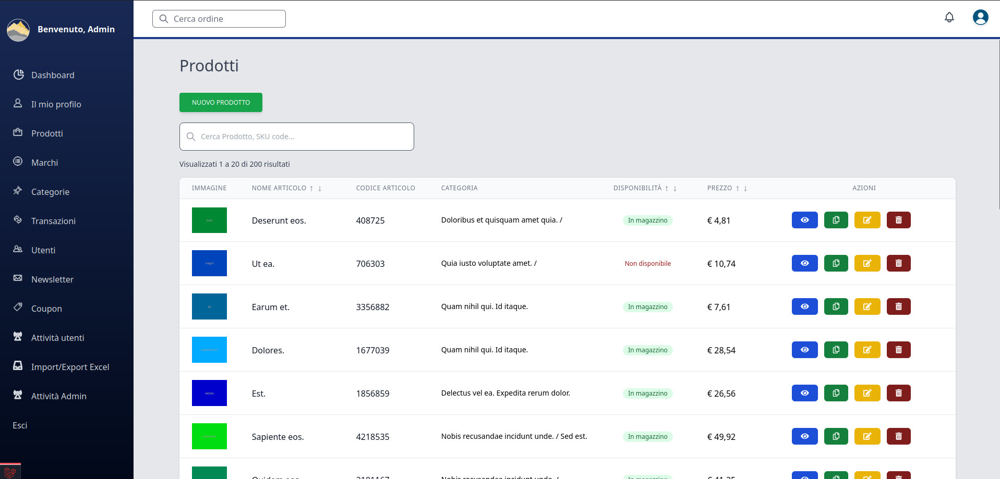
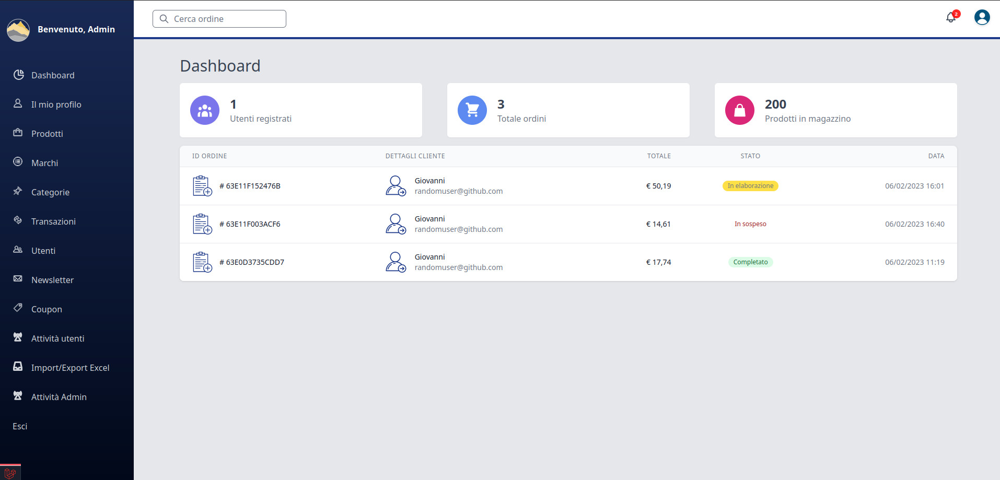

 

## E-commerce Laravel Full-Stack - Ecommerce + Stripe payment integration

## FEATURES

Fully functional E-commerce website front-end and back-end.

Using laravel 8 as an admin panel for the site.

You can simulate purchase product with Stripe PAYMENT integration
    
Javascript, Jquery, Tailwind CSS, Bootstrap and css for the front-end.

Excel Import/Export on Products.

LOG Monitoring Access on Admin & Customers.
    
Intelligent searching mechanism for products.
    
Awesome Cart package that uses session with Coupon Discount application.
    
An artisan command to seed the database with all neccessary dummy data.
    
Different user roles and privileges.
    
Categories, tags and price filtering for easier search for products.
    
And much more features.

 

### START (LARAVEL WEB SITE) LOCAL DEV [LIVEWIRE E-COMMERCE PLATFORM]

    composer install && composer dump-autoload
    npm install && npn run dev
    php artisan storage:link
    php artisan key:generate && php artisan serve

### POPULATE DATABASE WITH FAKE DATA [LIVEWIRE E-COMMERCE PLATFORM]

    php artisan migrate:fresh --seed

## ADMIN LOGIN PANEL

    ADMIN PANEL URL: http://localhost:8000/en/TyRLsvMqw

    username: jimipulsar@github.com
    password: 123pie456

